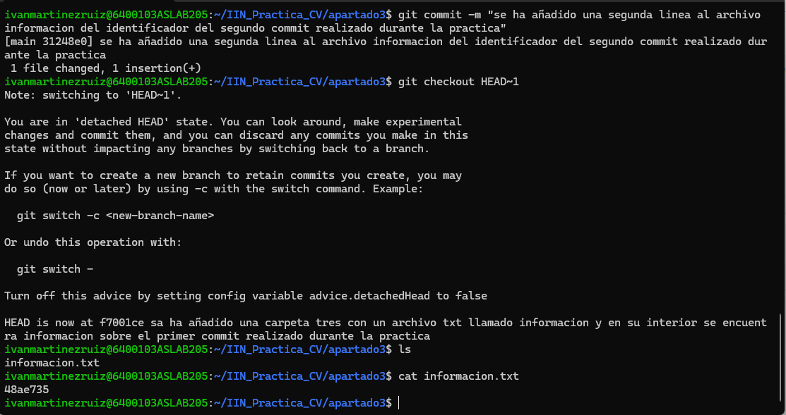

# Descripción del proyecto
Este repositorio contiene la práctica de sistemas de control de versiones. 
Incluye varios apartados donde se crean archivos, ramas, se resuelven conflictos y se trabaja con Git y GitHub.
# Pruebas de Código
Muestra de codigo de Visual del patron IClonable:

public class Monster : IClonable
{
    protected int health { get; set; }
    protected int speed { get; set; }

    public Monster(int health, int speed)
    {
        this.health = health;
        this.speed = speed;
    }
 
    public virtual Monster clonar(Monster monster)
    {
       return new Monster(this.health, this.speed);
    }

};

---------------------------------------------------------------------------------------------------------------------------

#AUTOR
Iván Martínez Ruiz

